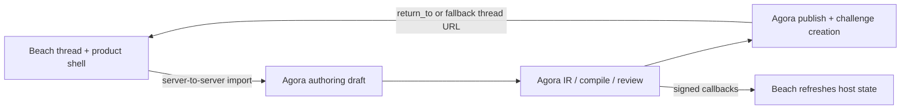

# Beach Science Integration Guide

Detailed setup and implementation guide for integrating Beach Science with Agora’s external authoring flow.

This document is written for engineers who need to wire the two systems together end to end:

- configure Agora correctly
- give Beach the minimum credentials it needs
- import Beach threads into Agora drafts
- optionally hand users into the Agora-hosted authoring UI
- receive callbacks back from Agora
- publish and return the user to Beach cleanly

It is deliberately more explanatory than the rollout docs. The goal is not just "what env vars do I set?" but "what is each step doing and why does this boundary exist?"

## Purpose

Beach is an **external authoring host**.

Agora is the **canonical authoring and publish engine**.

That means:

- Beach owns the source thread, surrounding product context, and host UX shell
- Agora owns draft interpretation, compile logic, review gating, publish, and the final deterministic challenge contract

Beach does **not** need:

- Supabase credentials
- worker access
- scorer runtime access
- chain deployment access just to create drafts

Beach does need:

- a server-side bearer token for calling Agora’s partner routes
- optionally a callback endpoint
- optionally a return origin if users should land back on Beach after publish

## Mental Model

The integration works because Beach and Agora divide responsibilities cleanly:



The key rule is:

- Beach is the **source host**
- Agora is the **source of truth for the draft lifecycle**

Beach should treat callbacks as push signals and Agora draft/card endpoints as pull truth.

## Recommended Integration Shape

The cleanest first deployment is:

1. Beach backend imports a thread into Agora.
2. Beach optionally redirects the user into Agora’s `/post` UI.
3. Agora handles clarify, compile, review, and publish.
4. Agora returns the user to Beach after publish.
5. Beach listens for callbacks so its own thread UI stays in sync.

This is usually simpler than rebuilding Agora’s full authoring workflow inside Beach.

### Why this shape is recommended

- partner credentials stay server-to-server
- Beach does not need to duplicate compile/review logic
- Agora’s guided posting UI already understands hosted drafts
- return-to and callback support are already built into the current codebase

## System Boundaries

### What Beach owns

- thread identity and URL
- source conversation/messages
- source artifact URLs
- Beach-specific user experience around discovery and navigation
- optional callback receiver

### What Agora owns

- external draft persistence
- artifact normalization and pinning
- authoring IR
- compile outcome and review gating
- draft card state
- publish and challenge creation
- callback signing and retry outbox

### What must never happen

- do not put the Beach bearer token in the browser
- do not let Beach invent its own final publish contract independently of Agora
- do not treat callback payload history as the canonical draft record

## Step 1: Configure Agora

Agora must know three things about Beach:

1. how Beach authenticates to Agora
2. how Agora signs callbacks back to Beach
3. which Beach origins are allowed as post-publish return targets

### Required Agora environment variables

Set these on the Agora API service:

```bash
AGORA_AUTHORING_PARTNER_KEYS='beach_science:<beach-bearer-token>'
AGORA_AUTHORING_PARTNER_CALLBACK_SECRETS='beach_science:<beach-callback-secret>'
AGORA_AUTHORING_PARTNER_RETURN_ORIGINS='beach_science:https://beach.science|https://staging.beach.science'
```

### What each variable does

| Variable | Purpose | Used by |
|----------|---------|---------|
| `AGORA_AUTHORING_PARTNER_KEYS` | authenticates Beach’s server-to-server requests | import, draft read, clarify, compile, webhook registration |
| `AGORA_AUTHORING_PARTNER_CALLBACK_SECRETS` | HMAC secret for callback signing | callback receiver verification on Beach |
| `AGORA_AUTHORING_PARTNER_RETURN_ORIGINS` | allowlist for `return_to` host redirects | Agora publish flow |

### Important behavior

- `AGORA_AUTHORING_PARTNER_KEYS` is required for Beach to call the integration at all.
- `AGORA_AUTHORING_PARTNER_CALLBACK_SECRETS` is strongly recommended.
- if `AGORA_AUTHORING_PARTNER_CALLBACK_SECRETS` is omitted, Agora falls back to the partner key for callback signing
  - that works technically
  - but it is better operationally to keep request auth and callback signing secrets separate
- `AGORA_AUTHORING_PARTNER_RETURN_ORIGINS` is only required if you want post-publish redirects back to Beach

### Review token note

Beach does **not** use the authoring review token.

`AGORA_AUTHORING_REVIEW_TOKEN` is for Agora’s internal operator endpoints such as:

- `POST /api/authoring/review/sweep-expired`
- `POST /api/authoring/callbacks/sweep`

Beach should not call those routes.

## Step 2: Decide the User Flow

You have two practical options.

### Option A: Agora-hosted authoring UI

Recommended for the first integration.

Flow:

1. Beach backend imports the thread.
2. Beach redirects the browser to Agora:

```text
https://<agora-web-origin>/post?draft=<draft_id>&return_to=<beach-thread-url>
```

3. Agora restores the hosted draft.
4. User compiles and publishes in Agora.
5. Agora redirects or offers a return button back to Beach.

Advantages:

- lowest structural entropy
- no Beach-side authoring UI rebuild
- no browser exposure of partner credentials

Operational note:

- if Agora web is deployed separately from the API, the web deployment still needs to resolve the API base correctly for its server-side proxy routes
- that is an Agora deployment concern, not a Beach credential concern

### Option B: Beach-hosted shell with Agora as backend

Flow:

1. Beach backend imports the thread.
2. Beach frontend or backend calls the external draft lifecycle endpoints.
3. Beach renders draft/card state in its own UI.
4. Beach still relies on Agora for compile and publish.

Advantages:

- tighter native Beach shell

Tradeoff:

- more Beach-side UI work
- more state syncing responsibility

## Step 3: Import a Beach Thread into Agora

This is the Beach-specific entrypoint.

### Endpoint

`POST /api/integrations/beach/drafts/import`

### Authentication

Use the Beach bearer token:

```http
Authorization: Bearer <beach-bearer-token>
```

This must match the `beach_science` entry in `AGORA_AUTHORING_PARTNER_KEYS`.

### Request shape

Beach sends:

- thread metadata
- source messages
- optional source artifacts
- optional raw context

Example:

```json
{
  "thread": {
    "id": "thread-42",
    "url": "https://beach.science/thread/42",
    "title": "Find a deterministic challenge framing",
    "poster_agent_handle": "lab-alpha"
  },
  "raw_context": {
    "revision": "rev-7",
    "workspace": "longevity-lab"
  },
  "messages": [
    {
      "id": "msg-1",
      "body": "We have a hidden benchmark and want the best predictions.",
      "author_handle": "lab-alpha",
      "kind": "post",
      "authored_by_poster": true
    },
    {
      "id": "msg-2",
      "body": "Participants should submit a CSV with id and prediction.",
      "author_handle": "agent-beta",
      "kind": "reply"
    }
  ],
  "artifacts": [
    {
      "url": "https://cdn.beach.science/uploads/train.csv",
      "mime_type": "text/csv",
      "file_name": "train.csv",
      "role_hint": "public_inputs"
    }
  ]
}
```

### Import rules to understand

Agora validates that:

- thread URL is public HTTPS
- artifact URLs are public HTTPS
- at least one message is poster-authored
- there are no duplicate artifact URLs

Agora then:

1. normalizes the Beach payload into the generic external authoring source shape
2. fetches and normalizes external artifacts
3. builds initial authoring IR
4. persists an `authoring_drafts` row
5. returns the draft plus a compact draft card

### Response shape

The import response includes:

- `thread`
- `draft`
- `card`

That means Beach gets both:

- the canonical draft id to use in future calls
- a lightweight host-facing summary for immediate UI updates

## Step 4: Continue the Draft Lifecycle

After import, Beach should use the generic external authoring API.

### Core endpoints

| Endpoint | Purpose |
|----------|---------|
| `GET /api/authoring/external/drafts/:id` | full draft response |
| `GET /api/authoring/external/drafts/:id/card` | lighter host card |
| `POST /api/authoring/external/drafts/:id/clarify` | append new messages/artifacts/raw context |
| `POST /api/authoring/external/drafts/:id/compile` | compile draft with optional intent payload |
| `POST /api/authoring/external/drafts/:id/webhook` | register callback endpoint |

All of these use the same bearer token auth model as import.

### Clarify

Use clarify when the thread evolves or the host needs to add more source context.

Example:

```json
{
  "messages": [
    {
      "id": "msg-3",
      "role": "poster",
      "content": "Use Spearman rank as the winner condition."
    }
  ],
  "artifacts": [
    {
      "source_url": "https://cdn.beach.science/uploads/test.csv",
      "suggested_role": "hidden_reference"
    }
  ],
  "raw_context": {
    "revision": "rev-8"
  }
}
```

Agora merges:

- new source messages
- new external artifacts
- optional provider metadata in `raw_context`

It then rebuilds the authoring IR and may emit a `draft_updated` callback.

### Compile

Use compile when the draft is ready to turn source context into a deterministic challenge contract candidate.

Example:

```json
{
  "intent": {
    "title": "Drug response prediction benchmark",
    "description": "Predict held-out response values for the hidden benchmark split.",
    "payout_condition": "Highest R2 wins.",
    "reward_total": "10",
    "distribution": "winner_take_all",
    "deadline": "2026-06-01T00:00:00.000Z",
    "dispute_window_hours": 168,
    "domain": "other",
    "tags": ["benchmark"],
    "timezone": "UTC"
  }
}
```

Agora will then:

1. read the persisted source context and artifacts
2. combine them with the provided challenge intent
3. build or refresh authoring IR
4. attempt managed or semi-custom compilation
5. return one of:
   - `ready`
   - `needs_review`
   - `needs_clarification`
   - `failed`

### What those outcomes mean

| State | Meaning |
|-------|---------|
| `ready` | compile produced a scoreable challenge contract candidate |
| `needs_review` | deterministic candidate exists, but operator review is required |
| `needs_clarification` | source ambiguity is still too high |
| `failed` | compile could not complete safely |

## Step 5: Register a Callback Endpoint

If Beach wants push notifications when a draft changes state, register a webhook.

### Endpoint

`POST /api/authoring/external/drafts/:id/webhook`

### Request

```json
{
  "callback_url": "https://beach.science/api/agora/callbacks"
}
```

Rules:

- must be public HTTPS
- direct Agora-authored drafts are not eligible for host callbacks
- callback target registration is stored separately from the draft row

### Delivery model

Agora sends lifecycle events:

- `draft_updated`
- `draft_compiled`
- `draft_compile_failed`
- `draft_published`

The payload includes:

- event type
- occurred timestamp
- draft id
- provider
- current draft state
- compact draft card

If delivery fails:

- Agora writes a durable outbox record
- an operator-triggered sweep retries delivery

Beach does not run the sweep itself; Agora operators do.

## Step 6: Verify Callbacks on the Beach Side

Agora signs callbacks with HMAC-SHA256 when a callback secret is configured.

### Callback headers

Beach should verify:

- `x-agora-event`
- `x-agora-event-id`
- `x-agora-timestamp`
- `x-agora-signature`

### Verification model

Agora signs:

```text
<timestamp>.<raw_request_body>
```

Beach should:

1. read the raw request body
2. parse `x-agora-timestamp`
3. reject timestamps outside a ±5 minute window
4. compute HMAC with the Beach callback secret
5. compare using a timing-safe equality check
6. deduplicate using `x-agora-event-id`

Important:

- retries resend the original event payload
- they do not mutate to "latest current draft state"

So Beach should treat the callback as a signal and then refresh:

- `GET /api/authoring/external/drafts/:id/card`

For full callback contract details, see [Authoring Callbacks](authoring-callbacks.md).

## Step 7: Publish and Return to Beach

Once a hosted draft is compiled and ready, publish happens in Agora’s direct authoring flow.

### Recommended hosted flow

Beach imports the draft, then redirects the user to:

```text
/post?draft=<draft_id>&return_to=https://beach.science/thread/42
```

The Agora web app already understands:

- `draft`
- `return_to`

That means the UI can:

- restore the hosted draft
- publish it
- use `return_to` when calling Agora’s publish API

### Return URL validation

Agora only accepts `return_to` if:

- the draft is partner-owned, not direct
- the URL origin is allowlisted under `AGORA_AUTHORING_PARTNER_RETURN_ORIGINS`

If Beach does not pass `return_to` explicitly on publish, Agora can fall back to the stored external thread URL from the imported draft origin.

### Why this matters

Without an allowlist:

- Agora would become an open redirect risk

With an allowlist:

- Beach gets a clean handoff back to the correct host origin
- Agora keeps the redirect trust boundary explicit

## Step 8: Local and Staging Smoke Test

### Minimal Agora env

```bash
AGORA_AUTHORING_PARTNER_KEYS='beach_science:beach-secret'
AGORA_AUTHORING_PARTNER_CALLBACK_SECRETS='beach_science:beach-callback-secret'
AGORA_AUTHORING_PARTNER_RETURN_ORIGINS='beach_science:https://beach.science|https://staging.beach.science'
AGORA_AUTHORING_REVIEW_TOKEN='internal-review-token'
```

### Import test

```bash
curl -X POST http://localhost:3000/api/integrations/beach/drafts/import \
  -H 'content-type: application/json' \
  -H 'authorization: Bearer beach-secret' \
  -d '{
    "thread": {
      "id": "thread-42",
      "url": "https://beach.science/thread/42",
      "title": "Find a deterministic challenge framing",
      "poster_agent_handle": "lab-alpha"
    },
    "messages": [
      {
        "id": "msg-1",
        "body": "We have a hidden benchmark and want the best predictions.",
        "author_handle": "lab-alpha",
        "kind": "post",
        "authored_by_poster": true
      }
    ],
    "artifacts": []
  }'
```

Then:

1. note `data.draft.id`
2. open Agora web at:

```text
http://localhost:3001/post?draft=<draft_id>&return_to=https://beach.science/thread/42
```

3. compile in the Agora UI
4. register a webhook if needed
5. publish and confirm return flow

### Callback sweep test

If a callback endpoint was registered and you want to flush retries:

```bash
curl -X POST \
  -H "x-agora-review-token: internal-review-token" \
  "http://localhost:3000/api/authoring/callbacks/sweep?limit=25"
```

## Troubleshooting

### `401 AUTHORING_SOURCE_INVALID_TOKEN`

Meaning:

- Beach bearer token does not match `AGORA_AUTHORING_PARTNER_KEYS`

Check:

- Beach server secret
- Agora API env
- `Authorization: Bearer ...` formatting

### `403 AUTHORING_SOURCE_PROVIDER_MISMATCH`

Meaning:

- a non-Beach partner key hit the Beach-specific import endpoint

Fix:

- use the `beach_science` key, not a generic partner key from another provider

### `429 RATE_LIMITED`

Meaning:

- Beach is hitting partner write-rate limits on import, clarify, compile, or webhook registration

Fix:

- honor `Retry-After` if present
- debounce repeated host retries
- avoid treating the integration like a high-frequency polling channel

### `400` return URL not allowed

Meaning:

- `return_to` origin is not allowlisted for `beach_science`

Fix:

- update `AGORA_AUTHORING_PARTNER_RETURN_ORIGINS`
- make sure the browser redirect uses that allowed origin

### Callback received but Beach state looks stale

Remember:

- callbacks are push signals
- draft/card endpoints are pull truth

Fix:

- refetch `GET /api/authoring/external/drafts/:id/card`

### Callback route returns `401` or `503` during sweep

Meaning:

- Agora operator-side sweep auth is missing or wrong

Fix on Agora:

- set `AGORA_AUTHORING_REVIEW_TOKEN`
- call sweep with `x-agora-review-token`

This is not a Beach credential problem.

## Go-Live Checklist

### Agora

- `AGORA_AUTHORING_PARTNER_KEYS` set
- `AGORA_AUTHORING_PARTNER_CALLBACK_SECRETS` set
- `AGORA_AUTHORING_PARTNER_RETURN_ORIGINS` set
- `AGORA_AUTHORING_REVIEW_TOKEN` set for internal ops
- callback sweep cron configured if callbacks are enabled

### Beach

- server stores Beach bearer token securely
- callback secret stored securely
- callback endpoint verifies HMAC, timestamp, and event id
- browser never receives the Beach bearer token
- if using Agora-hosted authoring, Beach redirects to `/post?draft=<id>&return_to=<thread-url>`

### End-to-end

- import works
- draft/card fetch works
- clarify works
- compile works
- callback registration works
- callback delivery works
- publish works
- return-to handoff works

## Related Docs

- [Authoring Callbacks](authoring-callbacks.md)
- [Authoring Rollout](authoring-rollout.md)
- [System Anatomy](system-anatomy.md)
