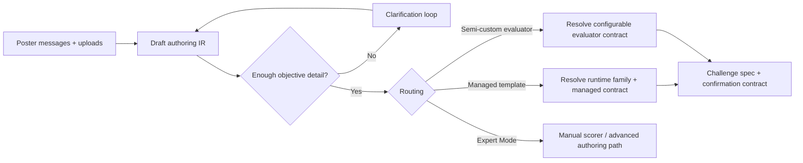

# Challenge Authoring IR

## Purpose

Define the typed intermediate representation Agora should use between open-ended poster language and a concrete challenge specification.

## Audience

Founders, product engineers, backend engineers, frontend engineers, and reviewers working on challenge posting, managed authoring, or scoring-runtime expansion.

## Read this after

- [Product Guide](product.md)
- [Principles](principles.md)
- [Architecture](architecture.md)
- [Protocol](protocol.md)
- [Data and Indexing](data-and-indexing.md)

## Source of truth

This doc is authoritative for the target authoring abstraction Agora should converge toward. It is not yet the source of truth for the live API, database schema, or compiler implementation.

## Summary

- Posters think in terms of problem, success criteria, privacy, timeline, and reward. They do not think in terms of runtime families.
- Agora still needs a deterministic evaluation contract before a challenge can publish.
- The missing layer today is a typed authoring IR between natural-language onboarding and the final challenge spec.
- The LLM or guided conversation should help fill this IR, but it should not be trusted to publish directly from prose.
- Runtime family selection should be a routing decision made after the IR is sufficiently complete, not the first abstraction the poster is forced into.

## Current Gap

Today the live managed-authoring flow jumps across three layers too quickly:

1. [`challengeIntentSchema`](../packages/common/src/schemas/managed-authoring.ts) stores free text plus economics.
2. The compiler in [`managed-authoring-compiler.ts`](../apps/api/src/lib/managed-authoring-compiler.ts) tries to infer a runtime family and metric directly from that text.
3. [`managed-authoring.ts`](../apps/api/src/lib/managed-authoring.ts) turns the proposal into a concrete challenge spec and submission contract.

That works for bounded managed cases, but it is too shallow for real-world posting because:

- ambiguity is not modeled explicitly
- objective details are mixed with prose
- artifact roles and privacy start as guesses instead of typed hypotheses
- there is no durable representation of "what is still unresolved?"
- runtime-family inference happens before Agora has a stable authoring contract

## Design Goals

- Accept natural-language problem statements without forcing posters to think in YAML or runtime-family terms.
- Preserve deterministic evaluation as the publish boundary.
- Ask clarifying questions when the challenge is ambiguous instead of guessing silently.
- Support both current managed runtimes and future semi-custom evaluator paths.
- Route unsupported or unsafe cases to Expert Mode early and honestly.
- Make ambiguity, confidence, and unresolved requirements explicit in state.

## Non-Goals

- Replacing the final challenge spec or submission contract.
- Letting an LLM publish a challenge without typed validation.
- Requiring a new Docker image for every new use case.
- Making runtime-family names part of the primary poster-facing UX.

## Target Flow



## Core Principle

The user-facing product question is not:

`Which runtime family is your challenge?`

It is:

`What do solvers get, what do they submit, how is winning measured, what stays private, and what reward/timeline applies?`

Runtime family, scorer image, and execution policy are downstream consequences of that contract.

## Proposed IR Shape

```ts
type RoutingMode =
  | "not_ready"
  | "managed_supported"
  | "semi_custom"
  | "expert_mode_required";

type Scoreability =
  | "deterministic"
  | "deterministic_with_custom_evaluator"
  | "not_objective_yet";

type Comparator =
  | "maximize"
  | "minimize"
  | "closest_match"
  | "pass_fail"
  | "custom";

type ChallengeAuthoringIR = {
  version: 1;
  source: {
    poster_messages: Array<{
      id: string;
      role: "poster" | "system";
      content: string;
      created_at: string;
    }>;
    uploaded_artifact_ids: string[];
  };
  problem: {
    raw_brief: string;
    normalized_summary: string | null;
    domain_hints: string[];
    hard_constraints: string[];
  };
  objective: {
    solver_goal: string | null;
    winning_definition: string | null;
    comparator: Comparator | null;
    primary_metric: string | null;
    minimum_threshold: string | null;
    secondary_constraints: string[];
  };
  artifacts: Array<{
    id: string;
    uri: string;
    file_name: string | null;
    mime_type: string | null;
    detected_schema:
      | {
          kind: "csv_table";
          columns: string[];
        }
      | {
          kind: "binary_or_other";
        }
      | null;
    poster_description: string | null;
    role_hypotheses: Array<{
      role: string;
      confidence: number;
    }>;
    selected_role: string | null;
    visibility: "public" | "private" | null;
    required_for_publish: boolean;
  }>;
  submission: {
    solver_deliverable: string | null;
    artifact_kind: string | null;
    schema_requirements: Record<string, unknown> | null;
    validation_rules: string[];
  };
  evaluation: {
    scoreability: Scoreability;
    evaluator_candidates: Array<{
      id: string;
      kind: "managed_template" | "semi_custom" | "expert";
      confidence: number;
      notes: string[];
    }>;
    selected_evaluator: string | null;
    runtime_family: string | null;
    metric: string | null;
    compute_hints: string[];
    privacy_requirements: string[];
  };
  economics: {
    reward_total: string | null;
    distribution: "winner_take_all" | "top_3" | "proportional" | null;
    submission_deadline: string | null;
    dispute_window_hours: number | null;
  };
  routing: {
    mode: RoutingMode;
    confidence_score: number;
    blocking_reasons: string[];
    recommended_next_action: string | null;
  };
  clarification: {
    open_questions: Array<{
      id: string;
      prompt: string;
      reason_code: string;
      blocks_publish: boolean;
    }>;
    resolved_assumptions: string[];
    contradictions: string[];
  };
};
```

## What Each Section Owns

| IR section | Owns | Why it exists |
|---|---|---|
| `source` | Raw poster turns and uploaded artifact references | Audit trail for how the contract was derived |
| `problem` | The poster's scientific or computational task in normalized form | Keeps domain framing separate from scoring mechanics |
| `objective` | What winning means in machine-checkable terms | This is the true core of the bounty |
| `artifacts` | Each uploaded file, candidate roles, privacy, and publish readiness | Prevents role/visibility from staying implicit guesses |
| `submission` | What solvers must upload and how it will be validated | Bridges poster intent to the final submission contract |
| `evaluation` | Whether the problem is objectively scoreable and which evaluator paths fit | Separates evaluation routing from user prose |
| `economics` | Reward, payout structure, deadline, dispute window | Existing contract-critical economics, but explicit in the same IR |
| `routing` | Whether Agora can proceed via managed, semi-custom, or Expert Mode | Makes support boundaries explicit instead of hidden |
| `clarification` | Open questions, assumptions, contradictions | Makes ambiguity first-class state rather than an afterthought |

## Compile Readiness Invariants

Agora should only compile or publish once these are true:

1. The solver deliverable is explicitly defined.
2. The winning condition is machine-checkable.
3. Every publish-required artifact has a role and visibility.
4. The evaluator path is deterministic enough to replay and dispute.
5. Reward, payout distribution, submission window, and dispute window are defined.
6. The IR has no unresolved contradictions that affect scoring or privacy.

If any of those are false, the system should stay in clarification or route to Expert Mode. It should not silently guess.

## Routing Rules

| Routing mode | Use when | Result |
|---|---|---|
| `not_ready` | Objective, submission, privacy, or economics are still underspecified | Ask the next blocking clarification |
| `managed_supported` | The IR maps cleanly to an existing managed evaluator and challenge spec | Produce the current managed compile output |
| `semi_custom` | The challenge is deterministic but needs evaluator configuration beyond today's managed templates | Produce a configurable evaluator contract, not a bespoke image by default |
| `expert_mode_required` | The evaluator is custom, multi-objective, non-deterministic, or still not objectively specified | Hand off to advanced/manual authoring |

## How Ambiguity Should Be Modeled

Agora should treat ambiguity as typed state, not as compiler failure text.

Examples:

- `vague_but_supported`
  - The poster knows the scientific problem but has not stated the submission format yet.
  - Expected behavior: ask what solvers submit and how winners are measured.
- `multi_family_ambiguous`
  - The brief could map to ranking, docking, or custom evaluation.
  - Expected behavior: disambiguate instead of guessing a runtime family.
- `objective_missing`
  - The poster has a dataset and a broad goal, but no machine-checkable winning rule.
  - Expected behavior: block compile until the scoring rule is explicit.
- `privacy_unclear`
  - It is not clear which files should remain hidden.
  - Expected behavior: ask before locking artifact visibility.
- `custom_evaluator`
  - The poster defines a legitimate objective, but it needs custom code or multiple weighted metrics.
  - Expected behavior: route to semi-custom or Expert Mode early.

## Managed, Semi-Custom, and Expert Paths

Agora should grow breadth in this order:

1. **Managed templates**
   - Prebuilt runtimes and deterministic evaluator contracts.
   - Fastest, safest, and cheapest operational path.
2. **Semi-custom evaluators**
   - Stable base runtimes with evaluator behavior supplied through config, DSL, or tightly-scoped scoring code.
   - Broadens coverage without making every new challenge an image-build problem.
3. **Expert Mode**
   - Full custom scorer and advanced authoring path.
   - Honest fallback when the evaluator cannot be expressed safely through the managed surface.

The operational goal should be:

`Most new use cases should not require shipping a fresh scorer image.`

## Mapping To Current Code

| Current construct | Current role | Future role under this IR |
|---|---|---|
| [`challengeIntentSchema`](../packages/common/src/schemas/managed-authoring.ts) | Free text + economics intake | Seed `problem`, `objective`, and `economics`; no longer the whole authoring contract |
| `authoringArtifactSchema` | Uploaded artifact metadata | Seed `artifacts` before role and visibility are resolved |
| [`clarificationQuestionSchema`](../packages/common/src/schemas/managed-authoring.ts) | Compiler follow-up prompts | Derived from `clarification.open_questions` |
| [`managed-authoring-compiler.ts`](../apps/api/src/lib/managed-authoring-compiler.ts) | Direct runtime-family inference | One provider that proposes IR deltas, evaluator candidates, and routing hints |
| [`managed-authoring.ts`](../apps/api/src/lib/managed-authoring.ts) | Draft-to-spec conversion | Consume a resolved IR and emit the final managed compile result |
| [`runtime-families.ts`](../packages/common/src/runtime-families.ts) | Registry of managed execution backends | Remains the source of truth for managed evaluator capabilities after routing |
| [`challenge-spec.ts`](../packages/common/src/schemas/challenge-spec.ts) | Final publishable contract | Stays the publish boundary; generated from a resolved IR |

## Implementation Status

This document still describes the target authoring contract, but large parts of the migration are already implemented in `main`.

### Phase 1: Persist the IR

Status: done

- `authoring_ir_json` is now a real persisted draft checkpoint.
- Guided `/post` and external source imports both populate the IR.
- The old direct-from-prose flow is no longer the only persisted authoring state.

### Phase 2: Clarification and routing from IR

Status: done

- Clarification prompts derive from unresolved IR fields rather than compiler-only prose.
- Ambiguity, routing mode, evaluator candidates, and artifact roles are first-class IR concepts.
- Runtime-family inference now sits downstream of routing instead of replacing it.

### Phase 3: Semi-custom evaluator contracts

Status: foundation done, executable expansion in progress

- Semi-custom evaluator contracts now exist between managed templates and full custom/expert paths.
- Typed evaluator archetypes are in place.
- Constrained executable semi-custom paths now exist for structured tables, exact artifact match, and structured record validation.
- Broader archetype coverage is still the active expansion area.

### Phase 4: Narrow the old compiler role

Status: done for architecture, still evolving in heuristics

- The compiler now proposes IR deltas, evaluator candidates, and routing hints.
- It is no longer the sole owner of the final authoring contract.
- Remaining work is mostly around improving domain-agnostic inference quality rather than changing the boundary.

### Phase 5+: Current next work

- Expand benchmark-led semi-custom evaluator coverage without adding arbitrary-code execution paths.
- Keep authoring heuristics broad and domain-agnostic.
- Continue tightening docs, tests, and operational guidance around the new draft and submission model.

## Benchmark Implications

Authoring benchmarks should not assert exact compile JSON for every prompt.

They should assert:

- required clarifications
- allowed routing outcomes
- banned unsafe outcomes
- privacy invariants
- submission-contract invariants

That keeps evaluation focused on whether Agora handles ambiguity safely, not whether it reproduces one canned output blob.

## Immediate Product Implication

The current guided `/post` experience is a good v1 shell, but the long-term product should converge on this sequence:

1. Poster describes the problem in natural language.
2. Agora turns that into a typed authoring IR.
3. Agora asks only the blocking clarification questions.
4. Agora routes the resolved IR into managed, semi-custom, or Expert Mode.
5. Only then does Agora produce the final challenge spec and publish contract.

That is how Agora can become more open-ended without sacrificing deterministic evaluation or operational safety.
